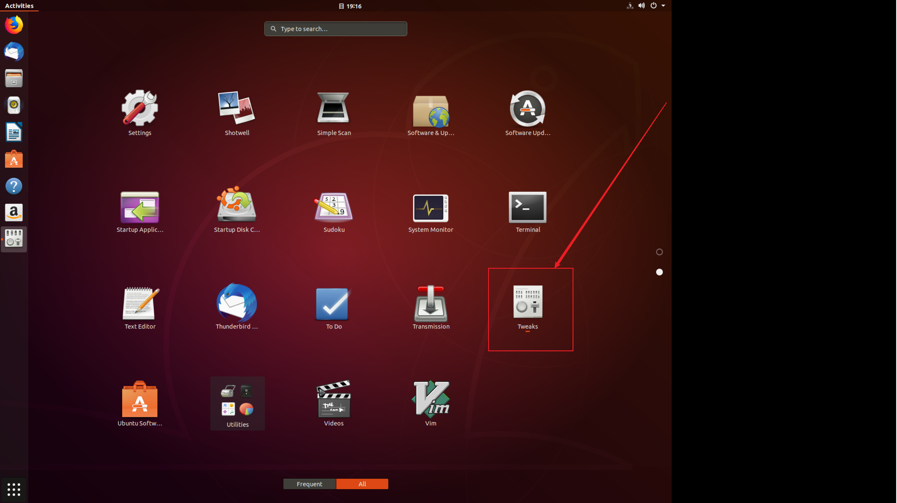
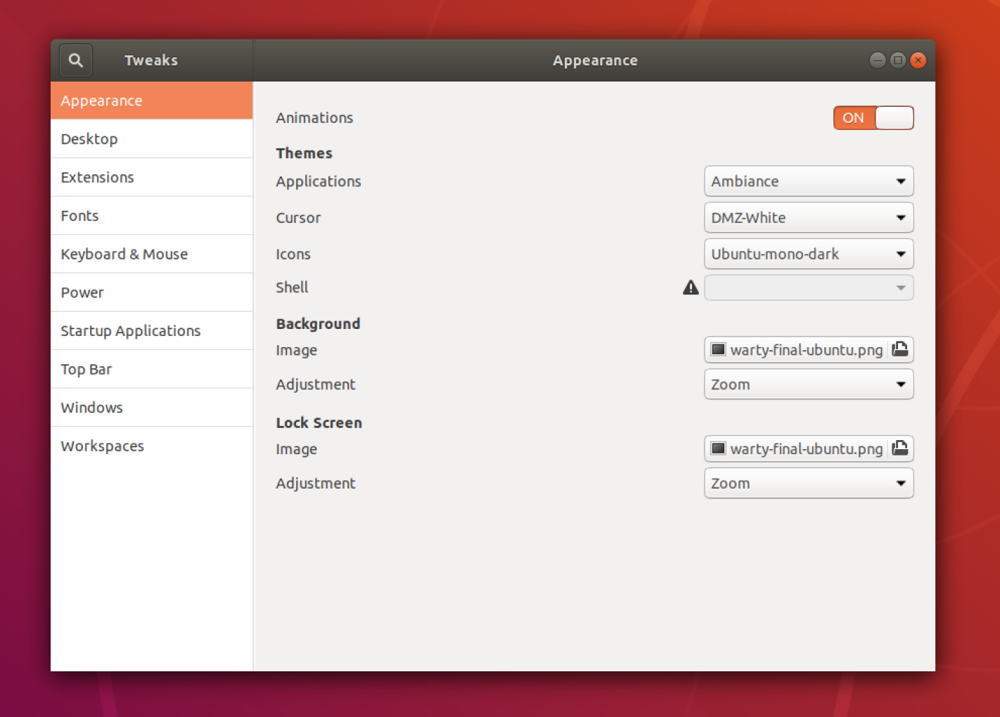
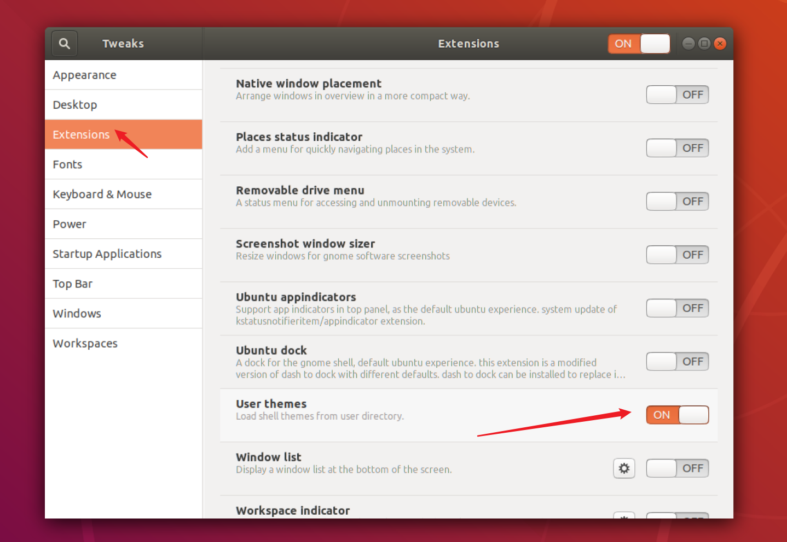
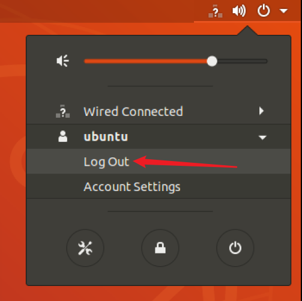
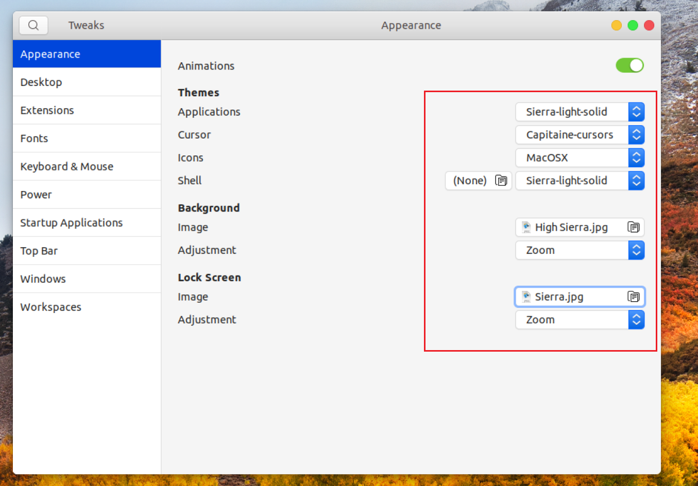
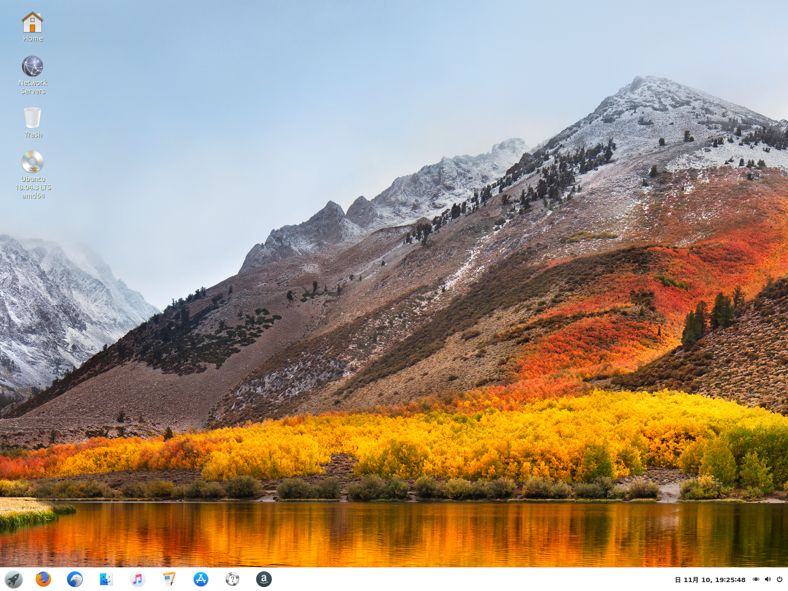
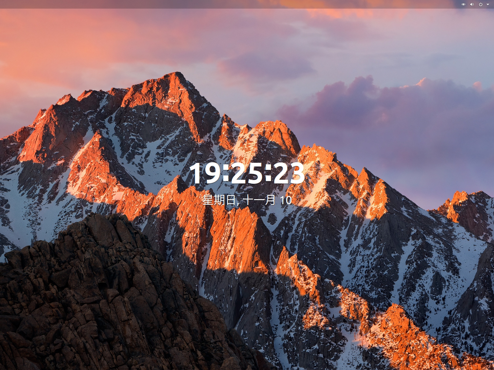
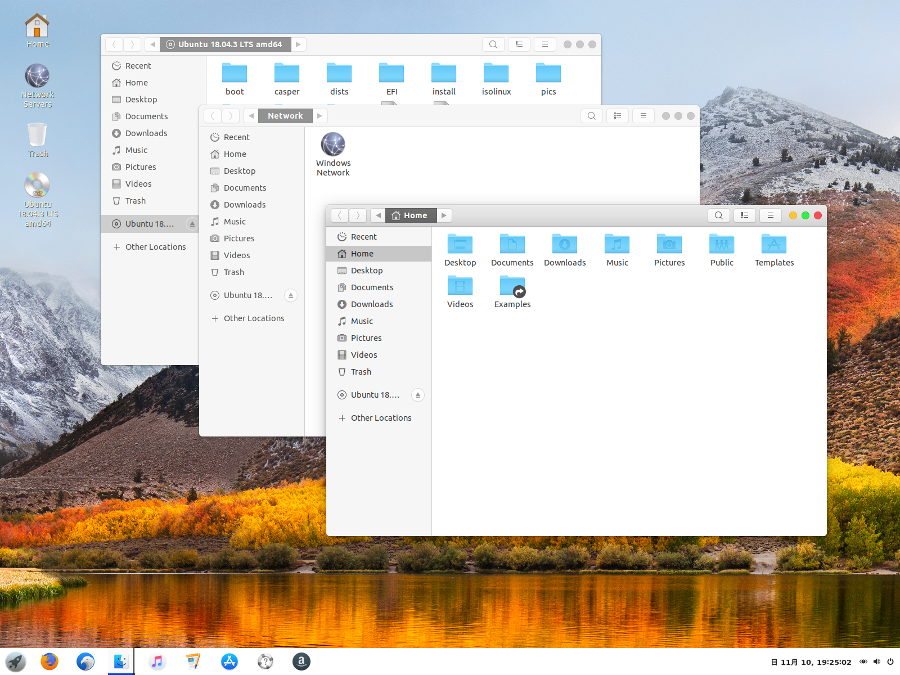
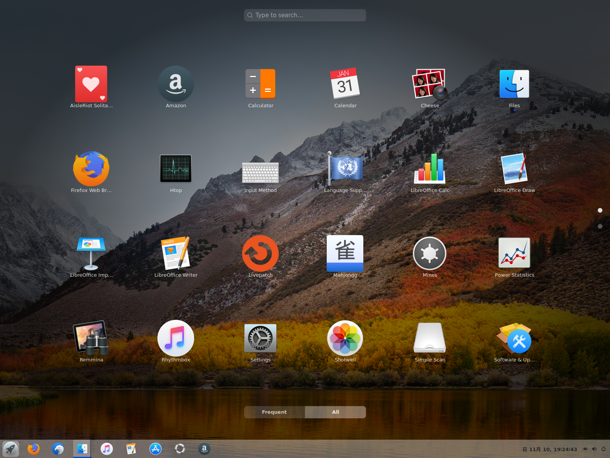

# Ubuntu18.04 主题更换为 Mac OS high Sierra

```
Something I hope you know before go into the coding~
First, please watch or star this repo, I'll be more happy if you follow me.
Bug report, questions and discussion are welcome, you can post an issue or pull a request.
```

安装步骤：

1. 获取主题资源
2. gnome-tweaks 启用插件
3. gnome-tweaks 配置主题项


## 获取主题资源

```
#!/bin/bash

set -ex

sudo apt-get install -y git gnome-tweaks gnome-shell-extensions gnome-shell-extension-dash-to-panel
git clone https://github.com/yifengyou/Ubuntu18.04-MacOS-themes
tar -xvf ./Ubuntu18.04-MacOS-themes/themes/Sierra-light-solid.tar.xz -C /usr/share/themes/
tar -xvf ./Ubuntu18.04-MacOS-themes/icons/MacOSX-cursors.tar.xz -C /usr/share/icons/
tar -xvf ./Ubuntu18.04-MacOS-themes/icons/MacOSX-icon-theme.tar.xz -C /usr/share/icons/
tar -xvf ./Ubuntu18.04-MacOS-themes/backgrounds/HighSierra-wallpapers.tar.xz -C /usr/share/backgrounds/
tar -xvf ./Ubuntu18.04-MacOS-themes/fonts/Fonts-MyraidSetPro.tar.xz -C /usr/share/fonts/
```

* 任意目录创建脚本```touch env.sh```，赋予执行权限```chmod a+x env.sh```
* 将上述脚本内容填入```vim env.sh```或```nano env.sh```
* 执行脚本```./env.sh```(非root用户提示sudo输入密码)
* 安装必要的软件包，git仓库获取主题资源，解压主题资源到对应目录
* 运行成功后，注销桌面环境，重新登录


## gnome-tweaks 启用插件

* 注销桌面重新登录后启动gnome-tweaks应用，此时可以看到扩展插件中已经有**User themes**
* 不注销重新登录，看不到**User themes**插件







* 启用**User themes**插件后，再次注销桌面环境，重新登录




* 重新登录后再次开启gnome-tweaks应用，看一看到Shell配置这一栏已经不再是感叹图标，可以通过下拉菜单选择

## gnome-tweaks 配置主题项



* 开启gnome-tweaks应用，依次配置Mac主题元素

## 效果









## 参考

1. <https://www.jianshu.com/p/321e15ec863d>
